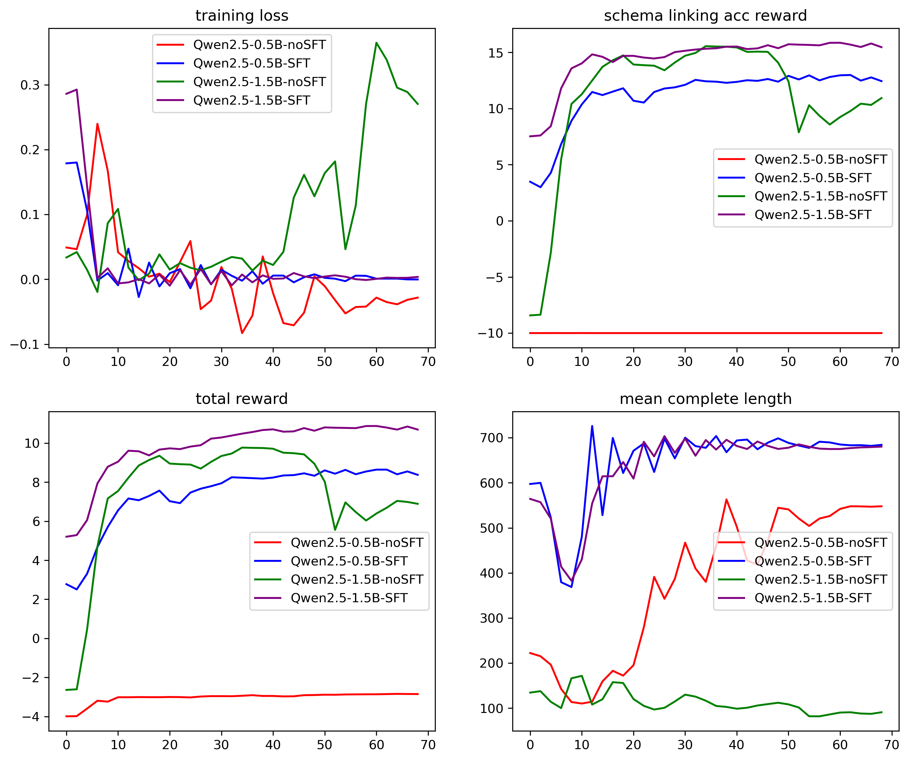

# Schema-R1
Our Paper: https://arxiv.org/abs/2506.11986


## Training Plots


## Setup
```shell
conda create -n schema-R1 python=3.11 && conda activate schema-R1 && pip install --upgrade pip
```

Next, install vLLM and FlashAttention:

```shell
pip install vllm==0.8.4
pip install setuptools && pip install flash-attn --no-build-isolation
Recommend manual download and installation [flash-attn](https://github.com/Dao-AILab/flash-attention/releases)
pip install swanlab==0.5.7 
```
Tips, check the transformer version while fail to start VLLM:
```shell
pip install transformers==4.51.3
pip install trl==0.18.0
```
## Training models
cd Schema-R1 root
Step 1: Cold start: 
```shell
python /src/SFT/grpo_SFT_spider_COT.ipynb    
#SFT_reasoning_data.csv is generated by deepseek-r1
```

Step 2: GRPO training: 
```shell
#Recommand 3*A100 40G for Qwn2.5-0.5B and 3*A100 80G for Qwen-2.5-1.5B
# Start VLLM
CUDA_VISIBLE_DEVICES=0 trl vllm-serve --model src/SFT_model 

# Training
CUDA_VISIBLE_DEVICES=1,2 ACCELERATE_LOG_LEVEL=info \
    accelerate launch --config_file test_order/zero2.yaml  --num_processes 2 \
    src/open_r1/grpo_schema.py --config test_order/config_schema_muti.yaml
```

## Evaluation
ALL eval process can be used in Schema-R1/src/eval/

## Acknowledegments

[Smol-r1](https://github.com/rasdani/smolR1)

[Open-r1](https://github.com/huggingface/open-r1)

[DTS-SQL](https://github.com/MohammadrezaPourreza/DTS-SQL)
